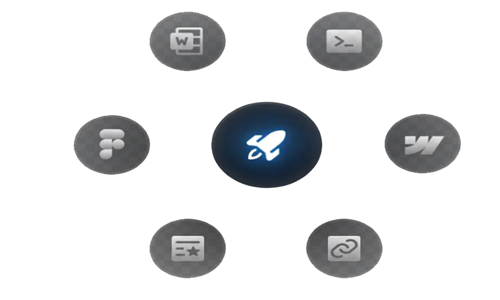
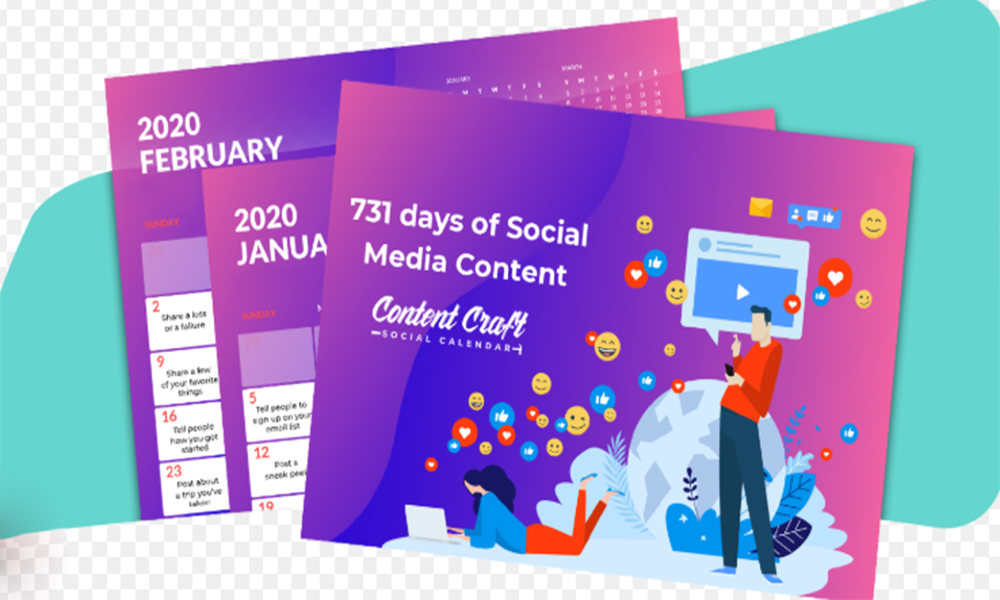
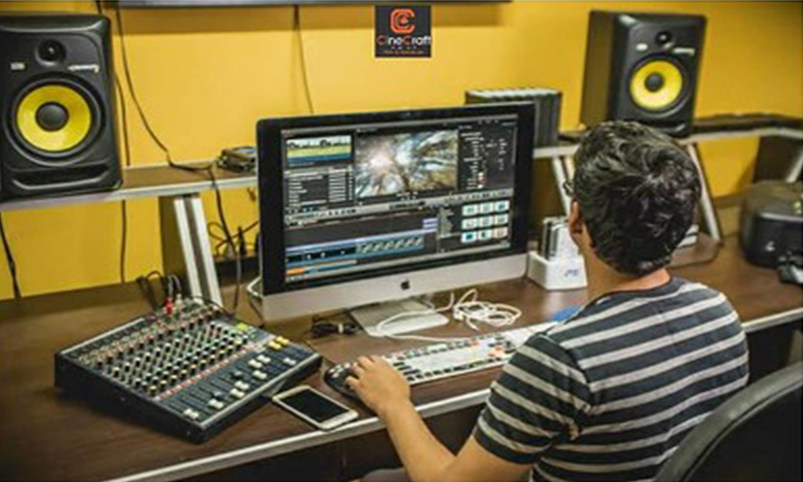

<!DOCTYPE html>
<html lang="en">
<head>
    <meta charset="UTF-8">
    <meta name="viewport" content="width=device-width, initial-scale=1.0">
    <title>Kibria Rony | Portfolio website</title>
    <link rel="stylesheet" href="style.css">
    <!-- boxicon css link -->
    <link href='https://unpkg.com/boxicons@2.1.4/css/boxicons.min.css' rel='stylesheet'>
    <!-- Link Swiper's CSS -->
  <link rel="stylesheet" href="https://cdn.jsdelivr.net/npm/swiper@10/swiper-bundle.min.css"/>
</head>
<body>
    

    <header>
        <a href="#" class="logo">Kibria Rony</a>
        <ul class="navlist">
            <li><a href="#home" class="active">Home</a></li>
            <li><a href="#about">About</a></li>
            <li><a href="#services">Services</a></li>
            <li><a href="#portfolio">Portfolio</a></li>
            <li><a href="#contact">Contact</a></li>
        </ul>
        

            <a href="https://wa.link/176ldn" class="btn">Let's chat <i class='bx bx-message-dots' ></i></a>
            

                

            

        

    </header>

    <section class="home" id="home">
        

            <h3>Welcome To my World</h3>
            <h1>Hi I'm Kibria Rony</h1>
<!-- 
            

                <h2>Software Engineer</h2>
            
 -->

            
Hello! I’m Kibria Rony, a passionate and result-driven Content Creator, Video Editor, and Digital Marketer with over a decade of experience in the online and creative industry.

I started my journey as a freelancer during my student life, working on platforms like Upwork, Fiverr, and other freelance marketplaces. I completed my bachelor's degree from Government Azizul Haque College, Bogura in 2011, and since then, my journey in the digital world has been full of growth and learning.

In 2017, I joined Panasonic Appliances Refrigeration Devices Malaysia Sdn Bhd, where I gained valuable experience in the corporate sector. Returning to Bangladesh in 2024, I began focusing full-time on content creation, and launched my own digital service brand.

As a verified and successful creator on Facebook and YouTube, I’ve built a strong online presence with an engaged audience. Through my website, I help individuals and businesses grow their brand by delivering high-quality digital services tailored to their goals.

If you're looking for a dedicated professional to bring your vision to life — you're in the right place.

            

                <a href="mailto:kibriaronybusiness@gmail.com" class="btn">Hire Me Now ! <i class='bx bx-right-arrow-alt' ></i></a>
                
            

            

                

                

                    <a href="@kibriarony_"><i class='bx bxl-instagram'></i></a>
                    
                

                
                

                    <a href="@kibriarony"><i class='bx bxl-tiktok'></i></a>
                    
                

                

                    <a href="@KibriaRony_"><i class='bx bxl-twitter'></i></a>
                    
                

                

                    <a href="https://www.facebook.com/kibriaRonybd/"><i class='bx bxl-facebook'></i></a>
                    
                

            

        

        

            
            

                

                    
I’m a Content Creator, Digital Marketer and Video Editor 

                

                <i></i>
            

        

    </section>

    <section class="about" id="about">
        

            
            

                
                
            

        

        

            <h2 class="heading">About Me</h2>
            <h3>Over 6 Years of Expertise in Video Editing, Digital Marketing & Social Media Management</h3>
            
I’m a creative professional with over 6 years of experience in video editing, digital marketing, and social media management. I specialize in creating engaging content for platforms like Facebook and YouTube, helping brands grow through impactful visuals and strategic campaigns. With a strong background in freelancing and content creation, I provide high-quality digital services tailored to each client’s unique goals.

!

            

                <button class="active">Main Skills</button>
                <button>Awards</button>
                <button>Education</button>
            

            

                

                    

                    
Video Editing

                    1. Video Editing & Post-Production
2. Motion Graphics & Visual Effects (VFX)
3. Social Media Video Editing
4. Color Correction & Grading

                

                

                    
Digital Marketing 

                    1. Digital Marketing Strategy & Execution

2. Social Media Marketing (SMM)

3. Search Engine Optimization (SEO)

4. Pay-Per-Click Advertising (PPC)

5. Email Marketing Campaigns

6. Content Marketing & Copywriting

7. Analytics & Performance Reporting
                

                

                    
Social Media Management

                    1. Content Planning & Strategy 2. Page & Profile Optimization 3. Audience Engagement & Community Building 4. Analytics & Performance Tracking.
                

                

                

                    

                    
Web Design Award

                    Award for creativity and user experience.
                

                

                    
Code and Development Award

                    Exceptional coding skills and develoment techniques
                

                

                    
Hackathons and coding Competiotions

                    Participating in hackathons and coding.
                

                

                

                    

                    
Govt. Azizul Haque College, Bogura

                     BCom (Hons) in Digital Marketing
                

                

                    
Ranirhat School & Technical College

                    Higher Secondary Certificate
                

                

                    
Govt Azizul Haque College. Bogura

                    Secondary School Certificate
                

                

            

            

                
            

        

    </section>

    <section class="services" id="services">
        

            <h2 class="heading">My Services</h2>
            what i will do for you
        

        

            

                

                    <i class='bx bx-layer' ></i>
                    
                

                <h3>Video Editing</h3>
                

We provide professional video editing services to transform your footage into stunning and engaging content. 
 
.

                
            

            

                

                    <i class='bx bx-code-alt' ></i>
                    
                

                <h3>Social Media Management</h3>
                
Strategic social media management services, professional solutions to build your brand, engage your audience, and deliver real results.

                
            

            

                

                    <i class='bx bx-desktop' ></i>
                    
                

                <h3>Graphics design</h3>
                
Creative and professional graphic design services to visually elevate your brand and communicate your message effectively.

                
            

            

                

                    <i class='bx bxs-party' ></i>
                    
                

                <h3>Digital Marketing</h3>
                
Comprehensive digital marketing solutions to grow your brand and reach your target audience effectively
.

                
            

        

        

            

                Get It Touch
                <h3>Have a Project On Your Mind</h3>
                <a href="#contact" class="btn">Contact Me</a>
            

            
        

        

            
            
            
            
            
        

    </section>

    <section class="portfolio" id="portfolio">
        

            <h2 class="heading">My Projects</h2>
            what i will do for you
        

        

            <button class="button mixitup-control-active" data-filter="all">All Work</button>
            <button class="button" data-filter=".web">Video Editing</button>
            <button class="button" data-filter=".uiux">Digital Marketing </button>
            <button class="button" data-filter=".branding">Social Media Management</button>
        

        

            

                

                    <h3>RankRise SEO Project</h3>
                    
Improved website ranking and organic traffic through strategic SEO optimization in the RankRise project
.

                    <a href="#" class="readMore">Explore More</a>
                

                

                    
                

            

            

                

                    <h3>ContentCraft Video Project</h3>
                    
Produced engaging and optimized video content to boost audience reach and retention in the ContentCraft Video Project
.

                    <a href="#" class="readMore">Explore More</a>
                

                

                    
                

            

            

                

                    <h3>CineCraft Studio Project</h3>
                    
Developed high-quality visual content and branding elements to enhance audience engagement in the CineCraft Studio Project.

                    <a href="#" class="readMore">Explore More</a>
                

                

                    
                

            

            

                

                    <h3>YouTube Flow Edit</h3>
                    
Edited and optimized YouTube videos to ensure smooth flow, viewer retention, and professional presentation in the YouTube Flow Edit project.

                    <a href="#" class="readMore">Explore More</a>
                

                

                    
                

            

            

                

                    <h3>SearchBoost Pro</h3>
                    
Enhanced search visibility and traffic growth through advanced SEO tactics in the SearchBoost Pro project
.

                    <a href="#" class="readMore">Explore More</a>
                

                

                    
                

            

            

                

                    <h3>Page/Profile Optimization</h3>
                    
Optimized social media pages and profiles to improve visibility, branding, and audience engagement in the Page/Profile Optimization project.

                    <a href="#" class="readMore">Explore More</a>
                

                
                

                    
                

            

        

    </section>

  

    <section class="down-box" id="contact">
        

            

                

                    <h2 class="heading">Contact Me</h2>
                    get in touch with me
                

                <form action="#">
                    

                        <input type="text" placeholder="First Name">
                        <input type="text" placeholder="Last Name">
                    

                    <input type="email" placeholder="Email">
                    <input type="text" placeholder="Subject">
                    <textarea name="#" id="" cols="30" rows="10">
                    </textarea>
                    

                        <button type="submit" class="btn">Send Message</button>
                    

                </form>
            

            

                

                    

                        

                            <h2 class="heading">My Skills</h2>
                            Let Me Help you
                        

                        

                            

                                

                                    

                                        <svg xmlns="http://www.w3.org/2000/svg" version="1.1" width="180px" height="180px">
                                            <defs>
                                                <linearGradient id="GradientColor">
                                                <stop offset="0%" stop-color="#e91e63" />
                                                <stop offset="100%" stop-color="#673ab7" />
                                                </linearGradient>
                                            </defs>
                                                <circle cx="85" cy="85" r="75" stroke-linecap="round" />
                                       </svg>
                                       <h2 class="counter">
                                        0%
                                       </h2>
                                    

                                

                                

                                    Digital Marketing
                                

                            

                            

                                

                                    

                                        <svg xmlns="http://www.w3.org/2000/svg" version="1.1" width="180px" height="180px">
                                            <defs>
                                                <linearGradient id="GradientColor">
                                                <stop offset="0%" stop-color="#e91e63" />
                                                <stop offset="100%" stop-color="#673ab7" />
                                                </linearGradient>
                                            </defs>
                                                <circle cx="85" cy="85" r="75" stroke-linecap="round" />
                                       </svg>
                                       <h2 class="counter">
                                        0%
                                       </h2>
                                    

                                

                                

                                     Social Media Management
                                

                            

                            

                                

                                    

                                        <svg xmlns="http://www.w3.org/2000/svg" version="1.1" width="180px" height="180px">
                                            <defs>
                                                <linearGradient id="GradientColor">
                                                <stop offset="0%" stop-color="#e91e63" />
                                                <stop offset="100%" stop-color="#673ab7" />
                                                </linearGradient>
                                            </defs>
                                                <circle cx="85" cy="85" r="75" stroke-linecap="round" />
                                       </svg>
                                       <h2 class="counter">
                                        0%
                                       </h2>
                                    

                                

                                

                                    Video Editing
                                

                            

                            

                                

                                    

                                        <svg xmlns="http://www.w3.org/2000/svg" version="1.1" width="180px" height="180px">
                                            <defs>
                                                <linearGradient id="GradientColor">
                                                <stop offset="0%" stop-color="#e91e63" />
                                                <stop offset="100%" stop-color="#673ab7" />
                                                </linearGradient>
                                            </defs>
                                                <circle cx="85" cy="85" r="75" stroke-linecap="round" />
                                       </svg>
                                       <h2 class="counter">
                                        0%
                                       </h2>
                                    

                                

                                

                                   Graphics design
                                

                            

                        

                    

                

            

        

    </section>

    <footer>
        
Copyright © 2025 by Kibria Rony || All Right Reservd.

    </footer>

    

        
            <i class='bx bxs-chevrons-up' ></i>
        
    

    <!-- scroll reveal  -->
    
    <!-- Swiper JS -->
     
    <!-- mixitup cdn js -->
    
    
</body>
</html>
